# 五种回答方式的实现逻辑

> 📂 对应代码：`graphrag/agents/graph_qa.py` → `GraphAgentResponder`
> 🔗 依赖：`graphrag/graph/_impl/queries.py`（`QueryMixin` 读侧方法）、`graphrag/graph/_impl/cypher.py`（Cypher 遍历，含原 `graph_queries`）、`graphrag/agents/graph_qa.py`（内联的提示词模板）
> 📊 本文图表为简洁版 Mermaid，节点文本统一加引号、避免特殊字符，以保证在各 Mermaid 渲染器下稳定显示。

---

## 🗺️ 导航：一图看懂五种策略

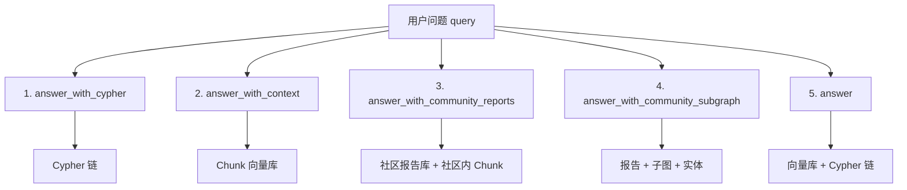

| 策略 | 一句话定位 | 成本 |
|------|-----------|------|
| ① `answer_with_cypher` | 只问图、不问向量，schema 越清晰越好 | 中/低 |
| ② `answer_with_context` | 最朴素 RAG，检索 chunk 直接答 | 低/低 |
| ③ `answer_with_community_reports` | 多社区报告 + 社区内 chunk 双路 | 中/低-中 |
| ④ `answer_with_community_subgraph` | 报告 + 整子图 + 实体，上下文最厚 | 高/中 |
| ⑤ `answer` | 向量与 Cypher 并行，综合最强 | 高/高 |

---

## 🏗️ 架构总览：三个 LLM + 图后端

`GraphAgentResponder` 是一个**多 LLM、多检索源**的智能体。它在 `__init__` 中把三类资源连接起来：

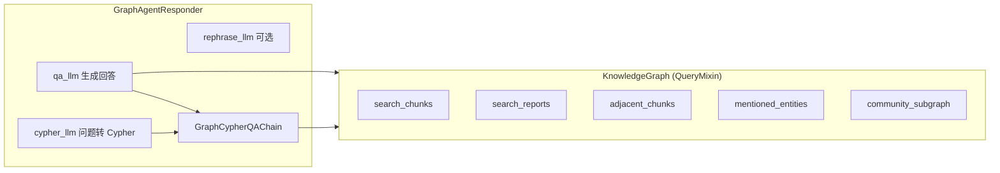

### 三个 LLM 的分工

| 属性 | 配置来源 | 是否必需 | 职责 |
|------|----------|:--------:|------|
| `self.qa_llm` | `qa_llm_conf` | ✅ 必需 | 几乎所有策略最终回答的生成者 |
| `self.cypher_llm` | `cypher_llm_conf` | ✅ 必需 | 在 Cypher 链中把问题翻译成 Cypher |
| `self.rephrase_llm` | `rephrase_llm_conf` | ⚪ 可选 | 按图 schema 改写问题以提升召回 |

### 四个 Prompt 模板

| 模板 | 用途 |
|------|------|
| `qa_prompt` | 普通问答（策略 ②③） |
| `qa_prompt_with_subgraph` | 带子图问答（策略 ④） |
| `summarize_prompt` | 多源融合总结（策略 ⑤） |
| `rephrase_prompt` | 问题改写（策略 ①⑤ 的可选前置） |

---

## 🔧 公共辅助方法

### `_rephrase(query, history)` — 问题改写（可选增强）

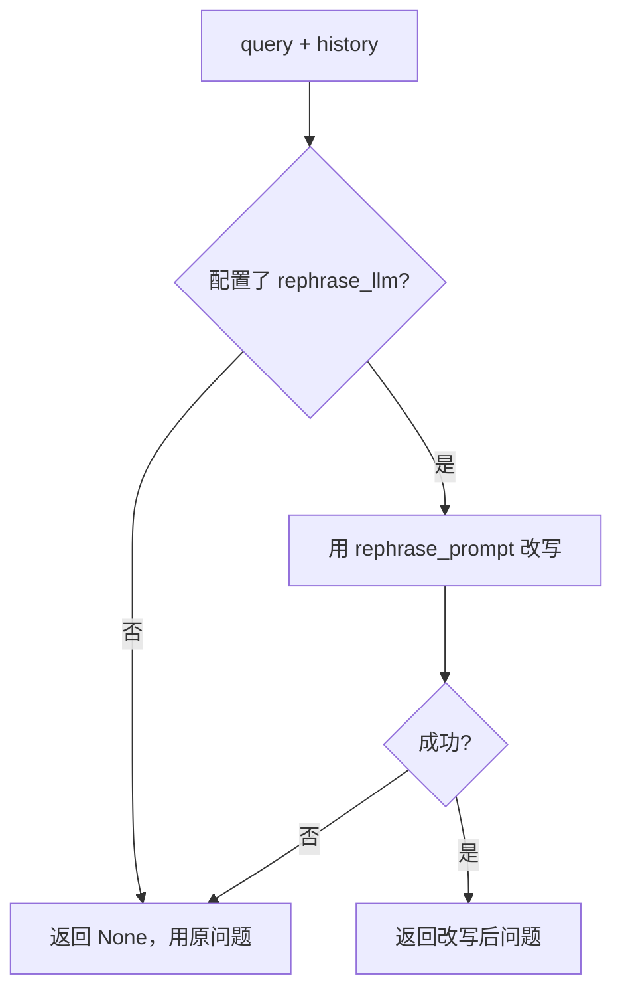

> 💡 改写失败时**自动降级**为原问题，绝不中断流程。仅策略 ① 和 ⑤ 进入 Cypher 路径前会调用。

### `_chunks_context(docs, use_adjacent_chunks)` — 上下文拼接

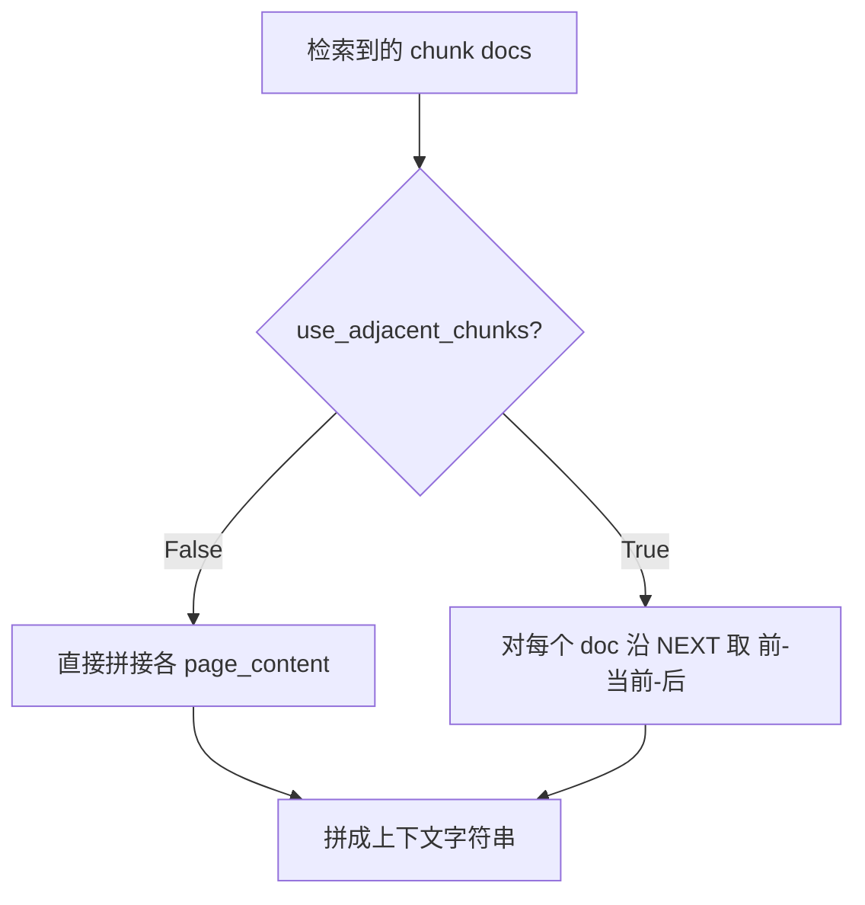

> ⚠️ `use_adjacent_chunks=True` 会为每个 doc 多发一次 `adjacent_chunks` 图查询，**延迟随命中数增长**。

---

## 📐 知识图谱中的关键关系

社区型策略（③④）能正常工作的前提，是图里存在以下结构与属性。摄入流水线（`upload.py`）会写入这些关系：

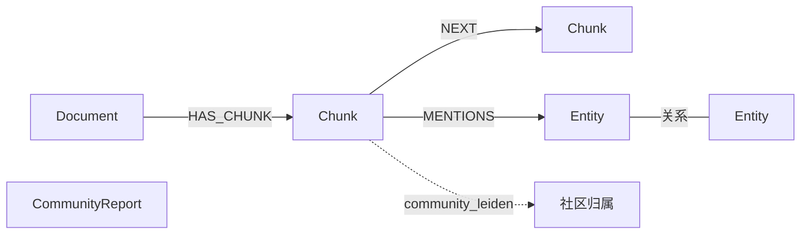

| 关系/属性 | 含义 | 谁会用 |
|-----------|------|--------|
| `NEXT` | chunk 的前后顺序 | `adjacent_chunks`（②③⑤可选） |
| `MENTIONS` | chunk 提到的实体 | `mentioned_entities`（④） |
| `community_{leiden\|louvain}` | chunk 所属社区 id | 社区内 chunk 过滤（③④） |
| `community_type` | 报告对应的算法 | 报告过滤（③④） |

---

## 1️⃣ `answer_with_cypher` — 纯 Cypher 链回答

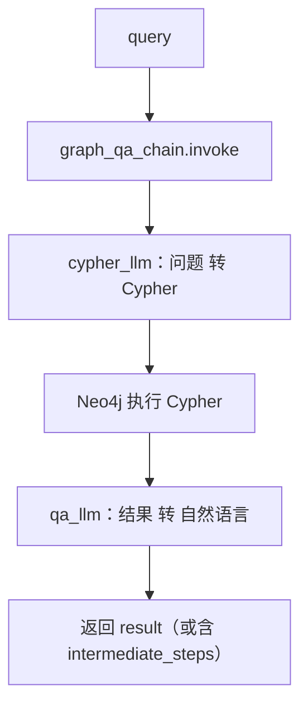

**签名**：`answer_with_cypher(query, intermediate_steps=False, history=None)`

**要点**
- **完全不碰向量检索**，纯结构化查询。问题越贴合图 schema，效果越好。
- 链以 `return_intermediate_steps=True` 构造 → 总会产出中间步骤 → 策略 ⑤ 可直接复用其 Cypher 与结果，**无需再跑一遍链**。
- 任何异常被捕获 → 返回 `None`（这是策略 ⑤ 判断 Cypher 路成败的信号）。

---

## 2️⃣ `answer_with_context` — 纯向量 RAG

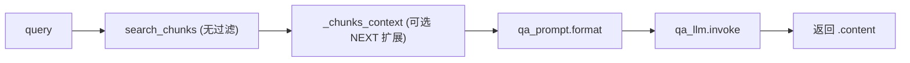

**签名**：`answer_with_context(query, use_adjacent_chunks=False, history=None)`

**要点**
- 最朴素 RAG：检索 chunk → 拼 context → 生成。**不用 Cypher、不用社区**。
- 检索失败时 `context_docs=[]`，仍以**空上下文**生成回答（不报错）。

---

## 3️⃣ `answer_with_community_reports` — 报告 + 社区 chunk 融合

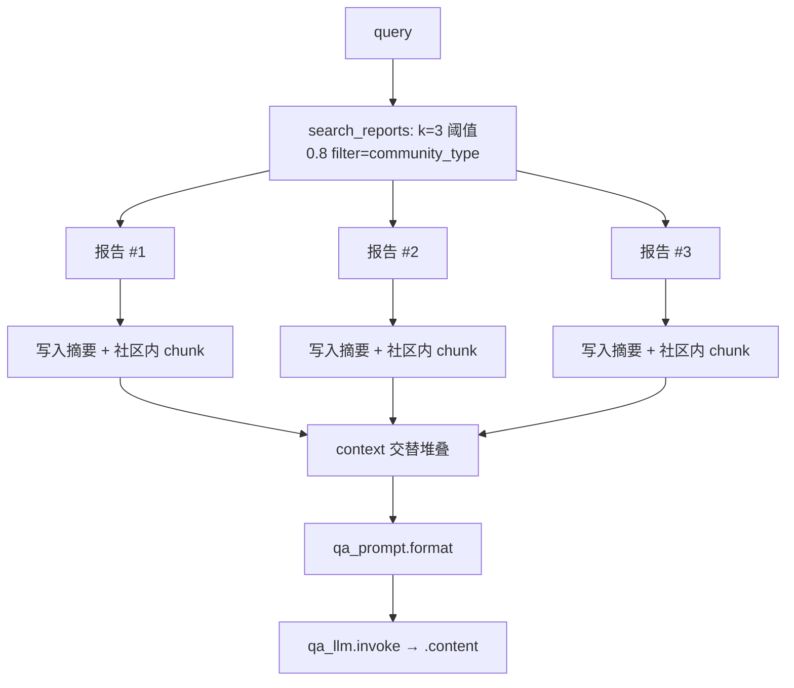

**签名**：`answer_with_community_reports(query, use_adjacent_chunks=False, community_type="leiden", history=None)`

**要点**
- **两路上下文在同一篇 prompt 里交替堆叠**：每个命中社区贡献「报告摘要 + 社区内相似 chunk」。
- 报告检索：`k=3`、相似度**阈值 0.8**、按 `community_type` 过滤。
- 社区内 chunk 过滤键：`community_{community_type}`（如 `community_leiden`）。
- ⚠️ **前置依赖**：摄入阶段必须为对应 `community_type` 生成并入库 `CommunityReport`（`upload.py` 第 8 步对 leiden 与 louvain 各跑一次），否则检索为空。

---

## 4️⃣ `answer_with_community_subgraph` — 报告 + 子图 + 实体（最重）

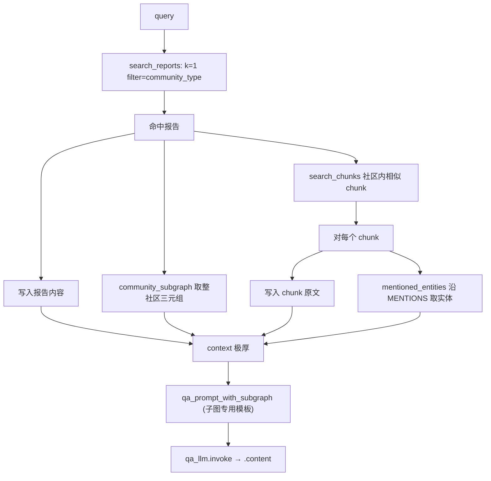

**签名**：`answer_with_community_subgraph(query, community_type="leiden", history=None)`

**要点**
- 与策略 ③ 的差异：报告**只取 k=1**、**不带分数/阈值**，但额外拉入**整子图三元组**与**逐 chunk 的 MENTIONS 实体**。
- 每个 chunk 都额外一次 `mentioned_entities` 图查询 → **延迟随社区内 chunk 数线性增长**。
- 子图可能很大，对小模型注意力窗口是压力（README：might get chaotic）。

---

## 5️⃣ `answer` — 向量 + Cypher 双路融合（综合最强）

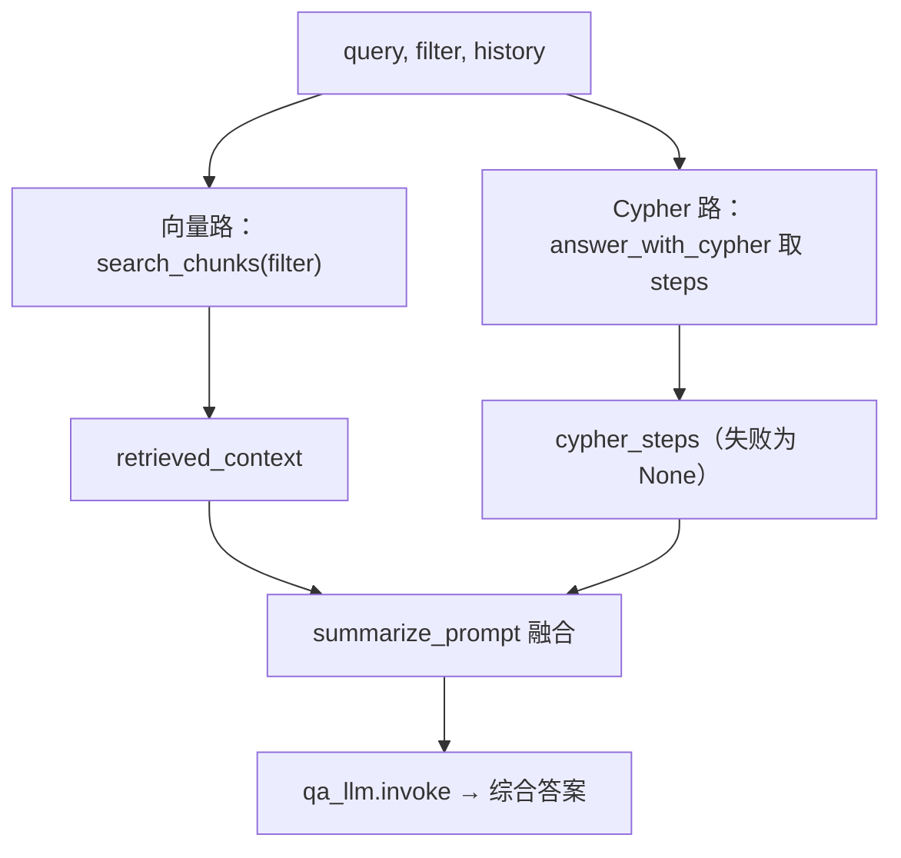

**签名**：`answer(query, use_adjacent_chunks=False, filter=None, history=None)`

**要点**
- 两路并行：**向量检索**（可带 `filter`，如限定来源文件夹）+ **Cypher 链**（复用策略 ①，**只取中间步骤** `cypher_steps`，不要其最终文本）。
- Cypher 路失败（返回 `None`）→ `cypher_steps=None`，**降级为纯向量回答**，流程继续。
- 用 `summarize_prompt` 把「向量上下文 + Cypher 结构化结果」融合为一份连贯答案。
- 注意：`answer` 本身**不调用 `_rephrase`**（改写已在其内部调用的 `answer_with_cypher` 里可选发生）。

---

## 📊 横向对比

| 维度 | ① cypher | ② context | ③ reports | ④ subgraph | ⑤ answer |
|------|:--------:|:---------:|:---------:|:----------:|:--------:|
| **Chunk 向量检索** | — | ✓ | ✓ 社区内 | ✓ 社区内 | ✓ |
| **CommunityReport 检索** | — | — | ✓ k=3/0.8 | ✓ k=1 | — |
| **Cypher 链** | ✓ 完整 | — | — | — | ✓ 取步骤 |
| **图遍历** | — | `NEXT`* | `NEXT`* | `MENTIONS`+子图 | `NEXT`* |
| **使用的 LLM** | cypher+qa | qa | qa | qa | qa(+cypher) |
| **使用的 prompt** | 链内置 | `qa_prompt` | `qa_prompt` | `…_with_subgraph` | `summarize_prompt` |
| **支持改写** | ✓ 可选 | — | — | — | ✓ 经 Cypher 路 |
| **Token 用量** | 中 | 低 | 中 | 高 | 高 |
| **延迟** | 低 | 低 | 低-中 | 中 | 高 |

> *`NEXT` 仅当 `use_adjacent_chunks=True` 时触发。

---

## ✅ 共性与容错约定

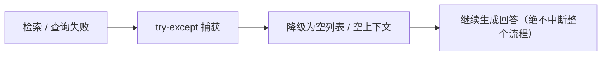

1. **检索/查询失败一律不中断**：除策略 ① 整体 try-except 返回 `None` 外，其余策略对每个 `search_*` / `mentioned_entities` 调用都单独 try-except，失败降级为空。
2. **社区过滤键命名统一**：检索社区内 chunk 时 filter 键恒为 `community_{community_type}`，与摄入写入的属性名一致——这是社区型策略能正确圈定范围的依据。
3. **改写 (`_rephrase`) 为可选增强**：仅配置 `rephrase_llm_conf` 时启用，失败自动降级。
4. **社区报告是硬依赖**：策略 ③④ 依赖摄入阶段已生成的 `CommunityReport`，未生成则检索为空。报告由 `IngestionPipeline` 在摄入时自动为 leiden 与 louvain 各生成一份。
